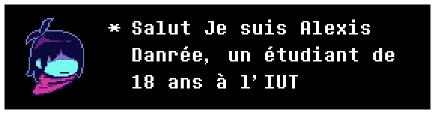
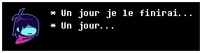

  
  

        

 

##  Compétences
* 
* Familier avec les concepts bas niveau, la programmation système, la programmation orientée objet et le développement de jeux.

 

##  Projets
<table border="1" bordercolor="#ffffff" cellpadding="10" cellspacing="0">
<tr>
<td width="50%" valign="top">

** MIPS32 Battleship Simulation**
* Simulation automatisée de Bataille Navale programmée entièrement en Assembleur MIPS32.
* Génère une grille dynamiquement et utilise un algorithme de ciblage récursif.

</td>
<td width="50%" valign="top">

** Rustidy**
* Un outil en ligne de commande rapide codé en Rust.
* Organise automatiquement les fichiers d'un dossier en les triant selon leur extension.

</td>
</tr>
<tr>
<td width="50%" valign="top">

** Tower-Defense** `En cours 🚧`
* Un projet de jeu de type Tower Defense développé avec Godot Engine et C#.
* Intégration en cours des mécaniques principales de jeu et du pathfinding.

</td>
<td width="50%" valign="top">

** CAN - Boat Booking System**
* Projet scolaire de première année réalisé en binôme.
* Comprend une application console en C# et un site web interactif en HTML/CSS/JS pour générer les cartes d'embarquement.

</td>
</tr>
</table>

 

##  Loisirs
* **PassportDex :** [Mon Profil PassportDex](https://passportdex.com/agentoutsiders)

 

##  Contact
* **Discord :** Tu peux cliquer sur la carte Discord ci-dessous pour m'envoyer un message.

 

## Statistiques 

  
  &nbsp;&nbsp;
  

    

  
  &nbsp;&nbsp;
  

