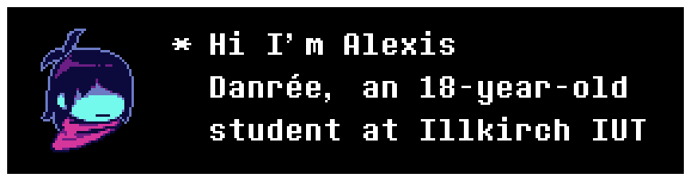
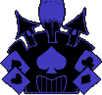
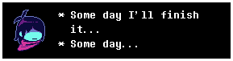
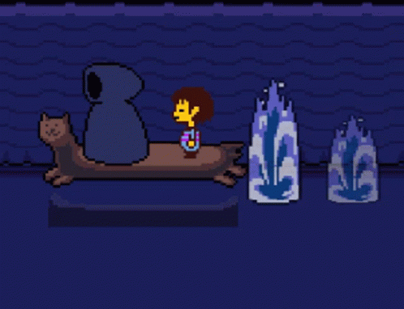
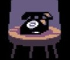

  
  

        

 

##  Skills
* 
* Familiar with low-level concepts, systems programming, Object oriented development and game development.

 

##  Projects
<table border="1" bordercolor="#ffffff" cellpadding="10" cellspacing="0">
<tr>
<td width="50%" valign="top">

** MIPS32 Battleship Simulation**
* Automated simulation of Battleship written entirely in MIPS32 Assembly.
* Features dynamic grid generation and a recursive hunting algorithm.

</td>
<td width="50%" valign="top">

** Rustidy**
* A fast command-line tool built with Rust.
* Automatically organizes messy directories by moving files based on their extensions.

</td>
</tr>
<tr>
<td width="50%" valign="top">

** Tower-Defense** `WIP 🚧`
* A Tower Defense game project built using Godot Engine and C#.
* Currently implementing core gameplay mechanics and pathfinding.

</td>
<td width="50%" valign="top">

** CAN - Boat Booking System**
* A 1st-year school project built by a team of two.
* Features a C# console application paired with a responsive HTML/CSS/JS website for boarding passes.

</td>
</tr>
</table>

 

##  Hobbies
* **PassportDex:** [My PassportDex Profile](https://passportdex.com/agentoutsiders)

 

##  Contact
* **Discord:** Click on the Discord card below to send a message.

 

## Stats 

  
  &nbsp;&nbsp;
  

    

  
  &nbsp;&nbsp;
  

